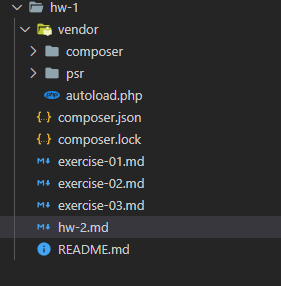
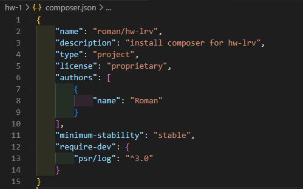

# Решение к homework №2

## Структура

## Composer

## Ответы на вопросы:

### 1. Разница между файлами composer.json и composer.lock:

- **composer.json**: Этот файл содержит информацию о зависимостях вашего проекта, включая названия пакетов, версии, настройки и другие данные. Он используется для определения зависимостей и их установки.
- **composer.lock**: Этот файл содержит конкретные версии всех зависимостей, которые были установлены в проекте. Он фиксирует версии пакетов на момент установки и предотвращает их обновление до тех пор, пока не будет запущена команда обновления.

### 2. Разница между директивами require-dev и require внутри файла composer.json:

- **require**: Эта директива используется для указания основных зависимостей проекта, которые необходимы для его работы в рабочем окружении.
- **require-dev**: Эта директива используется для указания зависимостей, которые нужны только во время разработки проекта, например, тестовые фреймворки, инструменты для анализа кода и т.д.

### 3. Разница между запуском команды composer install и composer update:

- **composer install**: Эта команда устанавливает зависимости проекта на основе информации из файла composer.lock. Если файл composer.lock уже существует, то будут установлены конкретные версии пакетов, указанные в нем.
- **composer update**: Эта команда обновляет зависимости проекта, учитывая версионные ограничения, указанные в файле composer.json. При этом файл composer.lock также будет обновлен с новыми версиями зависимостей.
