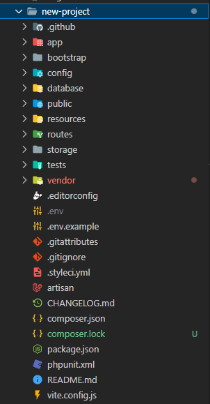

# Решение к homework №3

## Структура

## Server localhost

## Ответы на вопросы:

### 1. Перечислите список composer-пакетов, которые использует фреймворк Laravel после установки.:

Laravel - это фреймворк PHP, который использует несколько composer-пакетов для своей работы. Некоторые из популярных composer-пакетов, которые используются в Laravel после установки, включают в себя:

- guzzlehttp/guzzle
- symfony/http-foundation
- symfony/console
- illuminate/database
- illuminate/validation
- illuminate/support

### 2. Изучите директорию config и опишите какие файлы хранятся в этой директории:

Директория `config` в Laravel содержит файлы конфигурации, которые определяют настройки и параметры для различных компонентов и расширений фреймворка. Некоторые из файлов, которые могут храниться в директории `config`, включают в себя:

- `app.php` - Основные настройки приложения.
- `database.php` - Конфигурация для базы данных.
- `cache.php` - Настройки для кэширования.
- `mail.php` - Конфигурация для отправки электронной почты.
- `filesystems.php` - Настройки для файловых систем.

### 3. В какой директории хранятся основные файлы (классы) с бизнес-логикой приложения?:

Основные файлы (классы) с бизнес-логикой приложения в Laravel часто хранятся в директории `app`. Внутри этой директории находятся папки для различных компонентов приложения, такие как `Models`, `Controllers`, `Services`, `Repositories` и другие. В основном бизнес-логика хранится в файлах контроллеров, моделей и сервисов, которые находятся внутри этих папок.
